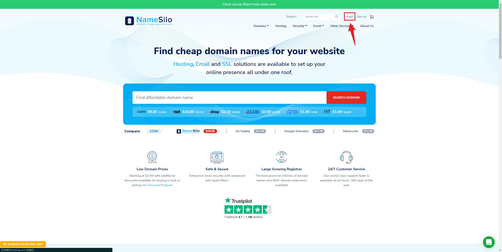

# VPS 搭建 Xray

## <1> 准备工作


### 1. 购买一台VPS （阿里云香港轻量应用服务器）

* 这里安装的是Ubuntu20.04版本
* 最好卸载监视 （如有）


### 2. 开启Ubuntu 20.04 自带BBR加速

```bash
# 修改系统变量
echo net.core.default_qdisc=fq >> /etc/sysctl.conf
echo net.ipv4.tcp_congestion_control=bbr >> /etc/sysctl.conf
# 保存生效
sysctl -p
# 执行
sysctl net.ipv4.tcp_available_congestion_control
# ---结果类似这样
# sysctl net.ipv4.tcp_available_congestion_control
# net.ipv4.tcp_available_congestion_control = reno cubic bbr
# ---

lsmod | grep bbr
# tcp_bbr                24576  3
```


### 3. Ubuntu 20.04安装Nginx

```bash
sudo apt update
sudo apt install nginx
sudo systemctl status nginx

systemctl start nginx
nginx -t # 查看Nginx
```

> 浏览器输入VPS 的 IP地址，出现Nginx的欢迎界面表示配置成功


> 可替换 /var/www/html 文件夹 from https://github.com/DuYooho/VPS_transfer


## <2> 绑定域名和VPS IPV4 Address

### 1. 访问 https://www.namesilo.com/ 并登录




### 2. 点击 My account


### 3. 点击 Manage My Domains


### 4. 选择一个域名，点击如图所示图标 Manage DNS


### 5. 删除所有默认解析


### 6. 点击添加A记录


### 7. 添加两条A记录


### 8. 等待，解析生效时间大概半小时-两小时，Ping IP/域名 查看是否生效

* https://ping.chinaz.com/


### 9. 修改nginx server，查看域名是否能访问Nginx欢迎页 (可以不修改先测试看看，Ubuntu好像不需要)


## <3> 为域名申请一个阿里云SSL证书

### 1. 创建一个证书，并点击证书申请


### 2. 填写信息


### 3. 下载验证文件到VPS中，等待签发

* Ununtu 应该是在/var/www/html 目录下，  Google一下如果报错


### 4. 签发成功后下载cert证书


* 将证书 （123456_www.xxx.com_nginx.zip）传到VPS /cert中并解压， 可通过https://github.com/DuYooho/VPS_transfer


## <4> VPS安装Xray

```bash
# https://github.com/XTLS/Xray-install
bash -c "$(curl -L https://github.com/XTLS/Xray-install/raw/main/install-release.sh)" @ install
```

可执行文件xray在 `/usr/local/bin` 目录下，配置文件位于 `/usr/local/etc/xray`目录内


* 将 https://github.com/DuYooho/VPS_transfer 中的config_server.json 放到 `/usr/local/etc/xray/config.json`  
  * 这里用到的配置是 https://github.com/XTLS/Xray-examples/tree/main/VLESS-TCP-XTLS-WHATEVER VLESS+TCP+XTLS 部分only。
  * 后续可以尝试一下其他的配置，这里websocket（ws）可以google一下，没有配置成功。
* 配置完毕后，可通过 `systemctl start xray` 运行 xray，`systemctl stop xray` 停止xray，`systemctl restart xray` 重启，`journalctl -xe --no-pager -u xra`y 查看运行日志。
* 最后，记得放行防火墙。如果是阿里云、腾讯云、AWS/GCP等大厂的服务器，还需要到网页后台的安全组放行端口。(阿里云不需要)


## <5> 客户端配置


